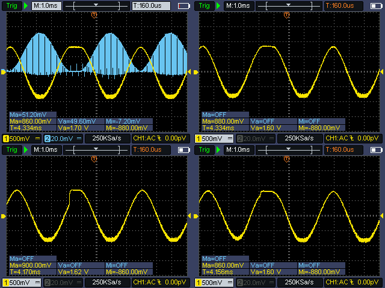

# Hybrid Hydra: audio-visual alignment with mixed signals [ICLC2027]

This repository includes the source code for the framework, scripts for plots,  example code and audio-visual recordings to accompany the paper.  




## Quick Start

- [VGA to Minijack converter](https://github.com/eternalmachine/VGA-Audio-Breakout)
- Go Fullscreen
- hide code on the VGA signal (overlay code for performances)

## Usage

### Simple modulated sine wave example
```js

await loadScript("https://cdn.jsdelivr.net/gh/bytosaur/hybrid-hydra@main/hybrid-hydra.js")

await initHybridHydra()

sine(10)
.modulate(sine(2))
.out()
```


### Simple sequenced Kick example
```js

await loadScript("https://cdn.jsdelivr.net/gh/bytosaur/hybrid-hydra@main/hybrid-hydra.js")

await initHybridHydra()

// mininotation pattern with attack, minimum note length and decay
t1 = track("<1 0 [1 0 1] 0>", 0, 0, 0.3)

acht(t1)
.out()
```


